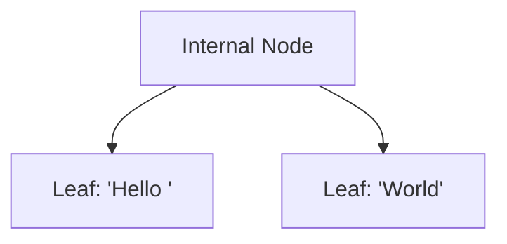
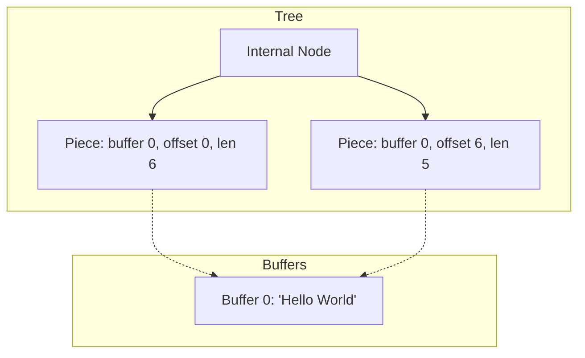
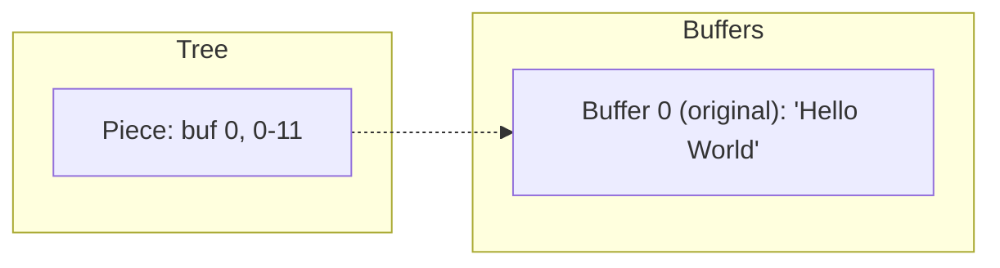
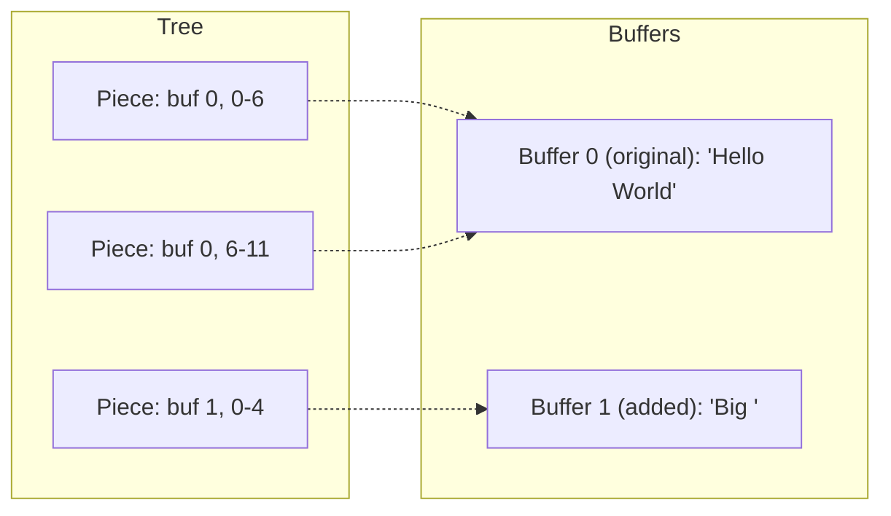
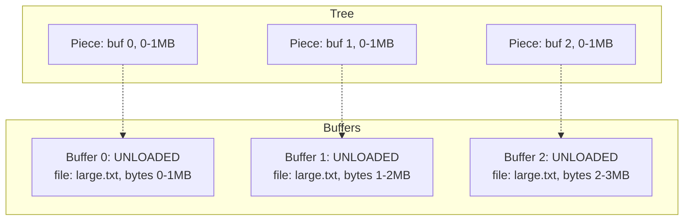
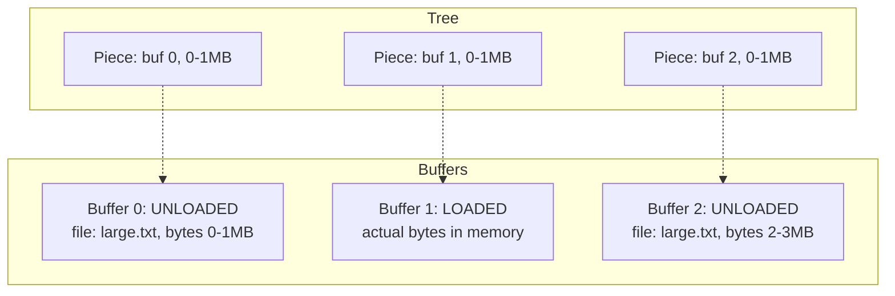
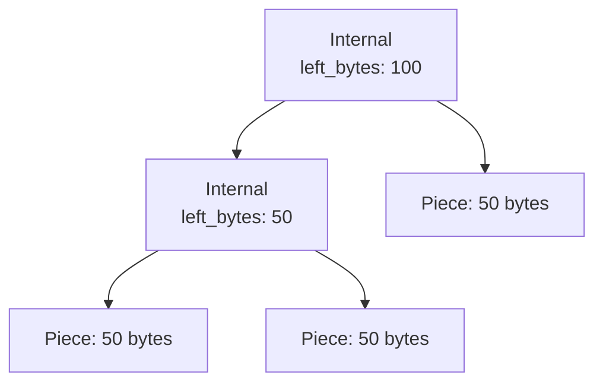
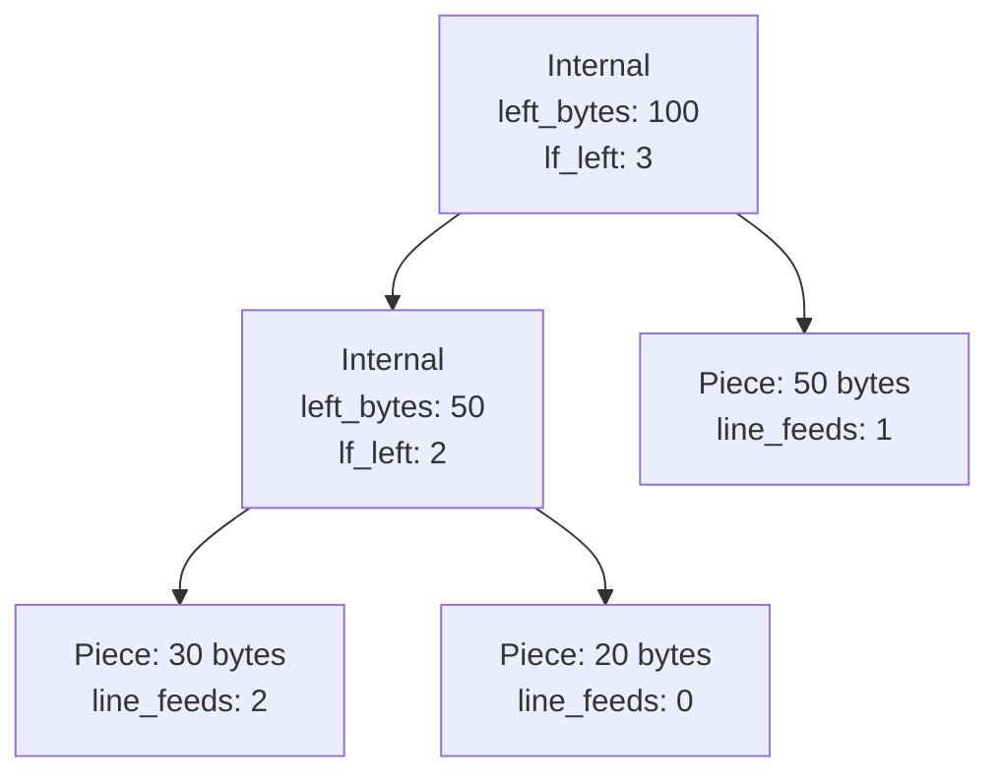
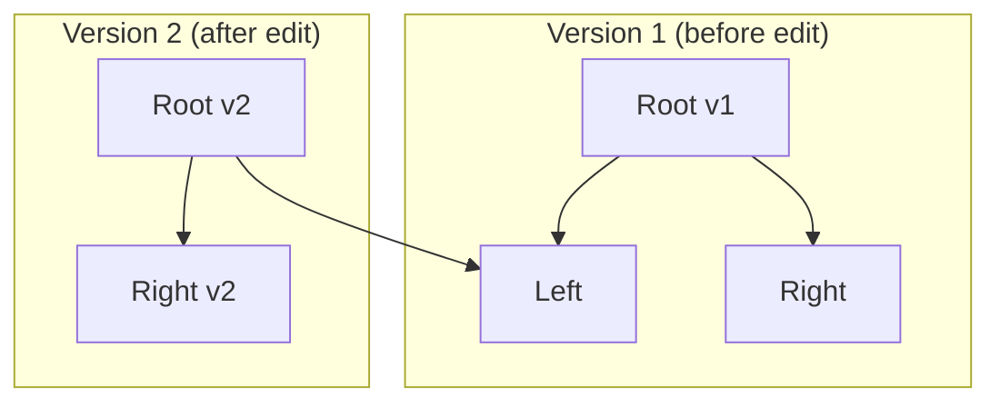

# How Fresh Loads Huge Files Fast

Fresh uses a **piece tree** (also called a piece table) for text storage. The piece table originated in the early 1970s - first in [J. Strother Moore and Bob Boyer's "77-Editor" at Edinburgh](https://www.computerhistory.org/collections/catalog/102740449) (1971-1973), where they applied structure-sharing techniques from their theorem proving research to text editing. Moore later brought the idea to Xerox PARC, where Charles Simonyi adopted it for the [Bravo editor](https://en.wikipedia.org/wiki/Bravo_(editor)) (1974). Simonyi later [brought it to Microsoft Word](https://www.tiny.cloud/blog/wysiwyg-development-history/) (1983). The design minimizes memory copying by never modifying original file content - critical for early systems with limited RAM. [VS Code adopted piece tables in 2018](https://code.visualstudio.com/blogs/2018/03/23/text-buffer-reimplementation), replacing their previous line-array implementation.

[Fresh](https://sinelaw.github.io/fresh/)'s implementation adds immutable nodes (for concurrency and cheap snapshots) and lazy loading (for large files). ([GitHub](https://github.com/sinelaw/fresh))

## The Core Idea

Instead of storing text in the tree, store **pointers** to text that lives elsewhere.

### Rope ([Helix](https://github.com/helix-editor/helix/blob/master/docs/architecture.md), [Zed](https://zed.dev/blog/zed-decoded-rope-sumtree))

Text lives inside tree nodes:



### Piece Tree (Fresh)

Tree nodes point to separate buffers:



A **piece** is just three numbers: which buffer, starting offset, and length.

## What Happens When You Edit

When you type or paste, Fresh appends to a new buffer and creates a piece pointing to it. The original buffer stays untouched.

### Before: File contains "Hello World"



### After: Insert "Big " at position 6



Document now reads: "Hello Big World"

The original file content in Buffer 0 was never modified or copied.

## Lazy Loading

For large files, Fresh doesn't load the entire file into memory. Buffers can be **unloaded** - they store a file path and byte range instead of actual data.

This is actually how the original [Word 1.1a](https://computerhistory.org/blog/microsoft-word-for-windows-1-1a-source-code/) piece table worked: pieces pointed directly to spans in the original file on disk, loading content only when needed. VS Code's 2018 implementation loads files fully into memory; Fresh returns to the original memory-conscious design.

### Before: 3MB file just opened



### After: User scrolls to middle

Fresh loads only the visible chunk from disk:



## Zero-Copy Reads

When reading text for display, Fresh doesn't copy bytes. It returns slices pointing directly into the buffers:

```rust
// Returns &[u8] pointing into buffer memory
// No allocation, no copy
let text = buffer.get_text_range(100, 200);
```

Multiple pieces can reference the same buffer region. Displaying the same text twice doesn't double memory usage.

## The Tree Structure

The pieces are organized in a balanced binary tree for fast lookups:



Each internal node caches the total bytes in its left subtree. To find byte offset 75:

1. Root has `left_bytes: 100`, and 75 < 100, so go left
2. Internal has `left_bytes: 50`, and 75 >= 50, so go right with offset 75-50=25
3. Piece has 50 bytes, offset 25 is within it

This is O(log P) where P is the number of pieces.

## Line Feed Tracking

Text editors need fast line-based operations: "go to line 1000", "what line is byte offset 50000 on?", or simply displaying line numbers. Scanning the entire document for newlines would be O(N) - too slow for large files.

Fresh tracks line feeds the same way it tracks bytes. Each piece stores its newline count, and internal nodes cache the count for their left subtree:



To find which piece contains line 3:

1. Root has `lf_left: 3`, and 3 >= 3, so go right with line 3-3=0
2. Piece L3 has `line_feeds: 1`, line 0 is within it

This enables O(log P) line-to-offset conversion. The same structure supports offset-to-line lookup by accumulating line counts while traversing.

## Large File Mode

For files over 100MB, Fresh switches to **large file mode**: no line indexing, pure byte-based navigation.

Why skip line indexing? Counting newlines in a 500MB file means reading the entire file - exactly what lazy loading tries to avoid. Instead, Fresh:

- **Navigates by bytes**: The viewport tracks a byte offset, not a line number. Scrolling moves by byte ranges.
- **Estimates line counts**: For the scrollbar and status bar, Fresh estimates total lines as `file_size / average_line_length`.
- **Shows approximate line numbers**: Visible lines display estimated line numbers based on bytes seen so far.

This means "go to line 50000" in a huge file is an approximation, but opening and scrolling remains instant regardless of file size.

## Immutable Tree Structure

Fresh uses immutable nodes - once created, a node is never modified. Edits create new nodes instead.

> **Implementation note:** Fresh is written in Rust. Nodes are wrapped in `Arc<T>` (Atomic Reference Counted pointer) - think of it as a pointer that tracks how many things reference it. Multiple parts of the code (even different threads) can safely hold the same `Arc`, and the data is automatically freed when the last reference is dropped. We'll gloss over this detail going forward - just know that "sharing" a node is cheap and thread-safe.

After an edit, old tree versions remain valid:



Version 2 shares the unchanged left subtree with Version 1. This enables:

- Undo/redo by keeping old root references
- Concurrent reads without locks
- Cheap snapshots

## Structural Diffing

Fresh uses piece tree structure to power gutter change indicators (the marks showing modified lines). The algorithm finds what changed since last save:

1. **Pointer check**: If saved and current tree roots are the same object, content is identical (instant).
2. **Structure diff**: Compare piece references to find differing byte ranges. O(pieces), not O(file size).
3. **Content verification** (optional): For small regions, verify bytes actually differ (handles undo edge cases).

The diff returns line ranges that Fresh checks against the current viewport - only visible changed lines need indicators. This is especially useful for large files: detecting modifications in a 500MB file requires comparing piece metadata, not reading from disk.

## Crash Recovery

Fresh auto-saves modified buffers every 2 seconds for crash recovery. The piece tree structure makes this efficient for large files.

**The key insight**: Recovery doesn't need to save the entire file - just the modifications. For a 500MB file with a few edits, Fresh saves only the changed chunks (a few KB), not 500MB.

The recovery format mirrors piece tree structure:
- Each chunk stores: byte offset, original length replaced, new content
- To recover: load original file from disk, apply chunks on top

This works because piece tree edits are already expressed as "replace bytes X-Y with content Z" - exactly what recovery chunks store. For new/small files, a single chunk contains the full content.

On crash detection (lock file exists but process died), Fresh offers to recover by reconstructing: original file + stored chunks → recovered content.

## Fresh vs VS Code

[VS Code also uses a piece tree](https://github.com/microsoft/vscode-textbuffer), but with a mutable tree - nodes are modified in place during rebalancing. Fresh uses a fully [persistent data structure](https://en.wikipedia.org/wiki/Persistent_data_structure): edits create new tree versions via path-copying, sharing unchanged subtrees between versions.

This gives Fresh cheap undo (keep old roots), lock-free concurrent reads, and instant snapshots - at the cost of more allocations per edit.

Fresh also implements lazy loading; VS Code loads entire files into memory.

## Comparison: Piece Tree vs Rope

Different editors use different text storage structures:

- **Piece tree**: VS Code, Fresh
- **[Rope](https://en.wikipedia.org/wiki/Rope_(data_structure))**: Helix ([Ropey](https://github.com/cessen/ropey)), Zed ([SumTree](https://zed.dev/blog/zed-decoded-rope-sumtree))
- **Rope-like**: Vim ([memline](https://github.com/vim/vim/blob/master/src/memline.c)), [Neovim?](https://github.com/neovim/neovim/discussions/25647)
- **[Gap buffer](https://en.wikipedia.org/wiki/Gap_buffer)**: Emacs

| Aspect | Piece Tree (Fresh, VS Code, MS Word 1.1) | Rope (Helix, Zed, Neovim?) |
|--------|----------------------------|-------------------|
| Node contents | Pointer to buffer | Actual text (~1KB chunks) |
| Insert | Append to buffer, add piece | May copy/split chunk |
| Original file | Preserved in buffer 0 | Reorganized into chunks |
| Large files | Lazy load regions (Fresh, Word 1.1a) | Must load or stream |
| Memory for edits | Minimal (just pointers) | Copies chunk data |

## Piece Tree Trade-offs

**Pros:** Original file preserved, inserts never copy existing text, natural lazy loading, pieces are small (~24 bytes) so more fit in cache, enables structural diffing (see above).

**Cons:** Extra indirection (find piece, then fetch buffer), buffer fragmentation over many edits, poor cache locality for text content. Piece count grows with edits, though periodic coalescing can mitigate this.

*(Note: Fresh's current implementation rebuilds the entire tree on each edit rather than path-copying, making edits O(P) instead of O(log P). This is an implementation gap, not inherent to the design.)*

## Further Reading

- [Fresh](https://sinelaw.github.io/fresh/) - The editor discussed in this post ([source on GitHub](https://github.com/sinelaw/fresh))
- [Microsoft Word 1.1a Source Code](https://computerhistory.org/blog/microsoft-word-for-windows-1-1a-source-code/) - Original piece table implementation from 1990
- [VS Code's Piece Table](https://code.visualstudio.com/blogs/2018/03/23/text-buffer-reimplementation) - Microsoft's 2018 write-up on reviving piece tables
- [Zed's Rope & SumTree](https://zed.dev/blog/zed-decoded-rope-sumtree) - How Zed implements ropes with B+ trees
- [Text Showdown: Gap Buffers vs Ropes](https://coredumped.dev/2023/08/09/text-showdown-gap-buffers-vs-ropes/) - Performance comparison
- [Data Structures for Text Sequences](https://www.cs.unm.edu/~crowley/papers/sds.pdf) - Charles Crowley, 1998 (academic survey)
